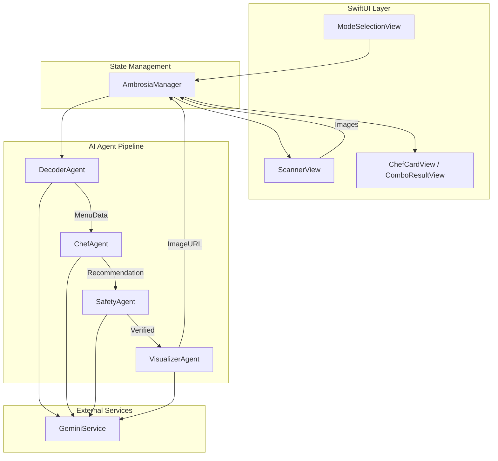
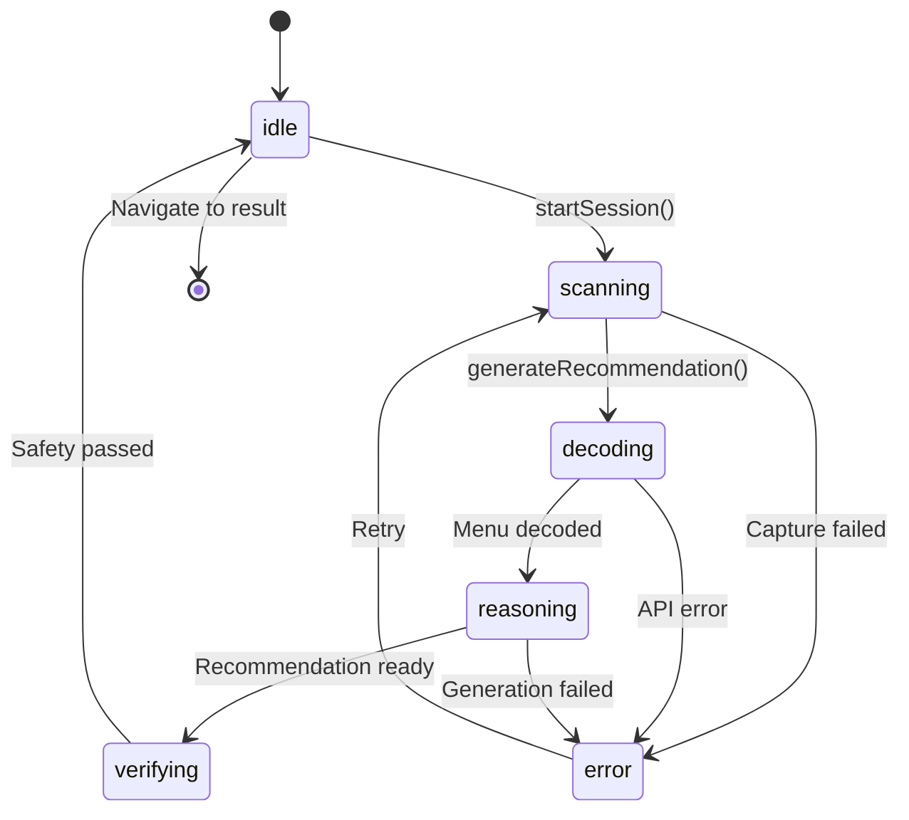

# Ambrosia Architecture Documentation

## Overview

Ambrosia is an AI-powered menu recommendation app built with SwiftUI, featuring a multi-agent architecture powered by Google Gemini.

---

## Architecture Diagram

---

## Component Responsibilities

| Component | Responsibility |
|-----------|----------------|
| **AmbrosiaManager** | Central state machine, coordinates agents, manages navigation |
| **DecoderAgent** | Extracts menu data from scanned images via OCR + LLM |
| **ChefAgent** | Generates recommendations based on profile and menu |
| **SafetyAgent** | Audits recommendations for allergens and dietary restrictions |
| **VisualizerAgent** | Generates dish visualization images |
| **GeminiService** | Handles all Google Gemini API communication |

---

## State Flow

---

## Design System

The app uses `AmbrosiaTheme` for consistent styling:
- **Colors**: Coral Sunset palette with semantic tokens
- **Typography**: SF Pro Rounded with Dynamic Type
- **Effects**: Glass morphism via `.ultraThinMaterial`
- **Backgrounds**: `ImmersiveBackground` with MeshGradient (iOS 18+)
