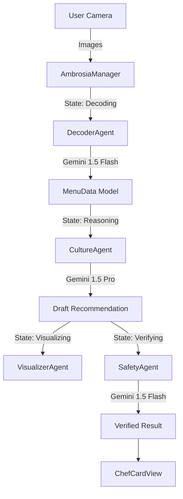

# Ambrosia 🍷
> **Your Personal AI Sommelier & Dining Consultant.**

**Ambrosia** is a native iOS application designed to solve "Menu Anxiety" and "Decision Paralysis" through AI-driven **Cultural Translation**. Unlike simple translation apps, Ambrosia *interprets* dishes, explains flavors, and ensures safety against allergies using a sophisticated **Multi-Agent System** powered by **Google Gemini 1.5**.

  

---

## 🌟 Key Features

### 1. Visual Menu Decoding (The Eye)
Instantly digitizes physical menus using **Gemini 1.5 Flash**. It understands layout, sections, and currency, turning raw pixels into structured JSON data.

### 2. Cultural Translation (The Brain)
Powered by **Gemini 1.5 Pro**, this agent acts as your local "Sommelier".
*   **Contextual**: Explains *what* a dish is, not just its name (e.g., translating "夫妻肺片" to *"Spicy Beef & Tripe (Served Cold)"*).
*   **Personalized**: Solves the "Knapsack Problem" to find the best combo under your budget.

### 3. Safety Guardrails (The Gatekeeper)
An automated "Critic" agent (SafetyAgent) that performs a rigorous double-check. If you have a peanut allergy, it scans ingredients and implicit associations to block dangerous recommendations—even if the main AI suggests them.

### 4. AI Visualization (The Artist)
Uses **Nano Banana** (Gemini 2.5 Flash Image / Imagen 3) to generate appetizing 8K visual previews for dishes that lack photos on the physical menu.

---

## 🏗 Architecture

Ambrosia is built on a **Manager-Worker Pattern** (Conductor Architecture). A central `AmbrosiaManager` orchestrates specialized sub-agents to ensure distinct responsibilities.



## 🛠 Tech Stack

*   **Platform**: iOS (Native)
*   **Framework**: SwiftUI + Combine
*   **Networking**: `URLSession` with Async/Await
*   **AI Models**:
    *   **Vision**: `gemini-1.5-flash`
    *   **Reasoning**: `gemini-1.5-pro`
    *   **Creative**: `gemini-2.5-flash-image` (Nano Banana)

---

## 🚀 Getting Started

### Prerequisites
*   Xcode 15+
*   Google AI Studio API Key (with access to `gemini-1.5` models)

### Installation

1.  **Clone the Repository**
    ```bash
    git clone https://github.com/ChrisZHHG/Ambrosia.git
    cd Ambrosia
    ```

2.  **Configure API Key**
    *   Open `GeminiService.swift`.
    *   Replace the placeholder string with your API Key:
        ```swift
        init(apiKey: String = "YOUR_GL_API_KEY")
        ```

3.  **Run in Simulator**
    *   Open the folder in Xcode.
    *   Select target "Ambrosia" and run (`Cmd + R`).
    *   *Note*: The `ScannerView` includes a mock mode for Simulator testing without a real camera.

---

## 🛣 Roadmap & Status

| Phase | Module | Status | Description |
| :--- | :--- | :--- | :--- |
| **I** | **Core Architecture** | ✅ Done | State Machine, Models, Git Init |
| **II** | **AI Core** | ✅ Done | Decoder, Culture, Safety Agents |
| **III** | **UI Implementation** | ✅ Done | Silky SwiftUI Views, Golden Theme |
| **IV** | **Visualizer** | ✅ Done | Nano Banana Integration |
| **V** | **Verification** | 🟡 Pending | Unit Tests & Flight Readiness Check |

---

## 📄 License
Private Repository. All Rights Reserved.